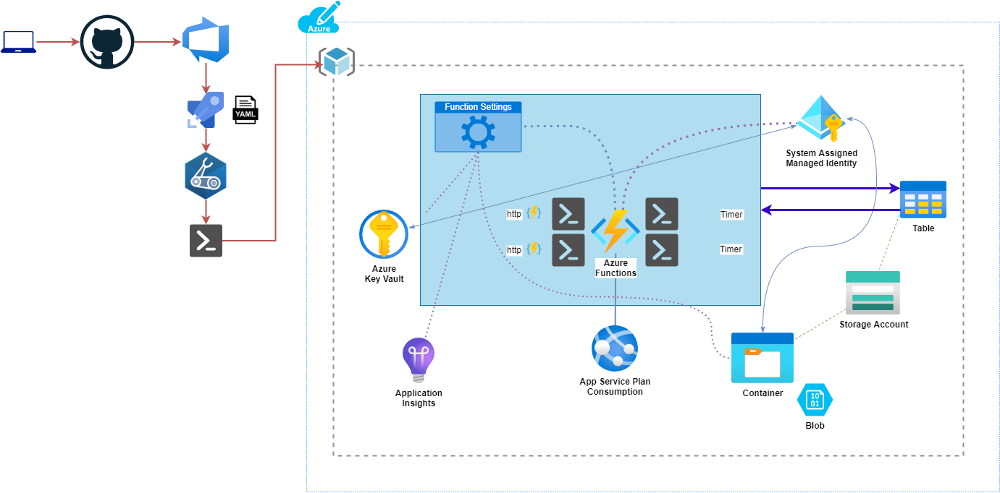
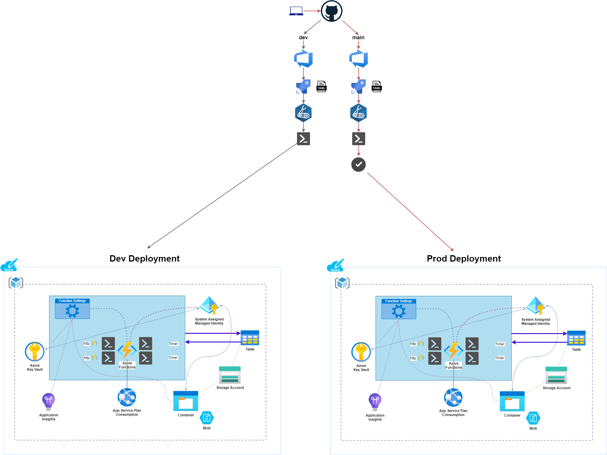

# PoshNotify

main | dev
--- | --- |
 | 

## Synopsis

PoshNotify is a serverless PowerShell application powered by Azure Functions that sends slack messages letting channels know when new things are happening with PowerShell.

## Description

PoshNotify is a real world, functional serverless PowerShell application. It is powered by [Azure Functions](https://docs.microsoft.com/azure/azure-functions/) and exists to notify slack channel members of various [PowerShell](https://github.com/PowerShell/PowerShell) news events.

This repository is linked with an [Azure DevOps pipeline](https://azure.microsoft.com/services/devops/) and deploys real-world Azure resources. However, it's primary purpose is to serve as a practical and referenceable example for deploying [PowerShell Azure Functions](https://docs.microsoft.com/en-us/azure/azure-functions/functions-reference-powershell).

*This is not THE way, this is ONE way*

There are not a lot of published practical examples today for deploying [Azure PowerShell functions](https://docs.microsoft.com/en-us/azure/azure-functions/functions-reference-powershell) via a CI/CD process. If you are looking to accomplish this you can explore this project to see how I tackled various tasks. To date, there aren't established best practices on this type of effort. So if you have a suggestion to improve, feel free to pop an issue and discuss!

What can you learn by looking over this project?

- How to deploy [Azure PowerShell Functions](https://docs.microsoft.com/en-us/azure/azure-functions/functions-reference-powershell) using [Azure DevOps]((https://azure.microsoft.com/services/devops/))
- How to build a custom [PowerShell module](https://docs.microsoft.com/powershell/scripting/developer/module/writing-a-windows-powershell-module?view=powershell-7.1) during the CI/CD process that is intended for use inside your [Azure Functions]((https://docs.microsoft.com/azure/azure-functions/))
- How to have your PowerShell functions leverage public modules on the PSGallery
- How to deploy Azure resources using [Bicep](https://github.com/Azure/bicep)
  - How to store various secrets (such as Storage Access Keys) in Azure Key Vault during the bicep deployment process
- How to assign permissions to enable your Azure PowerShell Functions to do things like:
  - Get secrets from Azure Key Vault (slack webhook, SA connection strings)
  - Write information to blob storage
  - Write and read to Azure Table Storage
  - Generate Application Insights information
- How to run [Azure DevOps on a self hosted pool](https://docs.microsoft.com/azure/devops/pipelines/agents/v2-windows?view=azure-devops)
- How to format an [Azure DevOps yaml file](https://docs.microsoft.com/azure/devops/pipelines/)
- How to use PowerShell in an Azure DevOps pipeline deployment
- How to use [Pester](https://github.com/pester/Pester) 5 in an Azure DevOps pipeline
- How to publish test results for beautiful graphs in Azure DevOps
- How to publish code coverage for beautiful graphs in Azure DevOps
- How to deploy a separate Dev and Prod stack using Azure DevOps
- How to properly build and structure Azure PowerShell Functions

### PoshNotify High Level Design

    

### PoshNotify Logical Flow

    

### PoshNotify Deployment Pipeline

    

## Author

[Jake Morrison](https://twitter.com/JakeMorrison) - [https://techthoughts.info/](https://www.techthoughts.info/)

## Notes

The PowerShell module inside this project was created using [Catesta](https://github.com/techthoughts2/Catesta).

Looking for a serverless PowerShell example on AWS instead? Check out [PSGalleryExplorer](https://github.com/techthoughts2/PSGalleryExplorer)

## License

This project is [licensed under the MIT License](LICENSE).
